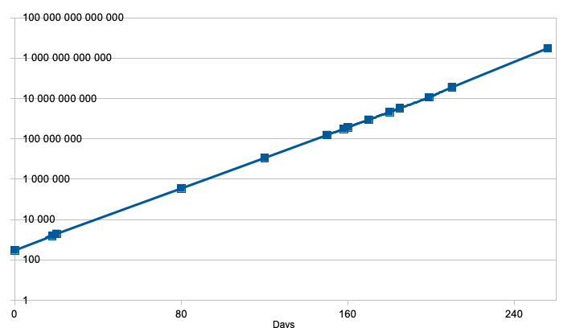

# Analysis

The growing of the school of fishs could be somewhat exponential, but for now **we do not know** it's growth rate yet.

# Design

First - and straight - idea was to simulate the Lanternfish's life and school of (linked) fishs.

```ada
type Lanternfish_Ptr is access all Lanternfish;

type Lanternfish is record
    Timer   : Life_Timer      := BabyFish;
    Sibling : Lanternfish_Ptr := null;
end record;
```

A new baby fish can be created easily throught the use of dynamic allocation when one comes at it's life-timer of `0`.

```ada
procedure New_Fish (Timer : Life_Timer) is
    (...)
begin
    (...)
    Last_fish := new Lanternfish;
    (...)
    Previous_Last_Fish.Sibling := Last_fish;
    (...)
end New_Fish;
```

## First results

### Population

Running the simulation for 18 or 80 days of a school of Lanternfish was cool 😎 ... in the begining 

Going further became a nightmare 😫 ... of over-population 🐟🐟🐟🐟🐟🐟🐟🐟🐟🐟🐟!

| Day | 🐟 Population | 🐟 Population |
| --:| --:| --:|
| 0 | 5 | 300|
| 18| 26| 1_563|
| 20| 34| 1_959|
| 80| 5_934| 350_605|
| 120| 191_336| 11_301_761|
| 150| 2_621_894| 154_900_658|
| 160| 6_311_710| 372_489_150|
| 170| 14_979_958| 883_463_328|
| 180| 35_890_123| 2_120_130_781|
| 185| 55_653_352| 3_285_743_983|
| 210| 490_587_171|  *Out of memory* |
| 256| *Out of memory* |  *Out of memory* |

Some charting shows clearly that growth is a 10 exponential here, with a factor depending on the initial data (5🐟 ou 300🐟) : respectively 24 or 20.




One can then extrapolate what the population would be after 256 days.

| Day | 5 Initial Population | 300 Initial Population |
| --:| --:| --:|
| 256| 39_300_000_000 | 3_070_000_000_000 |
| 256| 39 Giga | 3 Tera |

### Execution time

Execution time (sec) ... on a [Ryzen 3900](https://www.amd.com/en/products/cpu/amd-ryzen-9-pro-3900) @ 4.3 GHz equiped with 64 GB of RAM.

| Day | 5 🐟  at init. | 300 🐟 at init. |
| --:| --:| --:|
| 18 | 0.005 | 0.01 |
| 20 | 0.005 | 0.01 |
| 80 | 0.005 | 0.01 |
| 120 | 0.015 | 0.32 |
| 150 | 0.15 | 4.72 |
| 158 | 0.31 | 9.24 |
| 160 | 0.195 | 11.08 |
| 170 | 0.447 | 26.59 |
| 180 | 2.202 | 63.76 |
| 185 | 1.80 | 105.76 |
| 199 | 11.25 | Out of memory 162 GB |
| 210 | 29.25 |  Out of memory |
| 256 | Out of memory | Out of memory 284 GB |

# Clearly, have to find another simulation algorithm 🧞‍♂️

## 💡 New solution pattern 💡

Lets consider the fish population as a counting the pyramid of age.

```ada
Mature : constant := 0;
Young  : constant := 6;
BabyFish : constant := 8;

type Life_Timer is new Natural range Mature .. BabyFish;

type Pyramid_of_Age is array (Life_Timer) of Population;
```

This is now actually efficient!